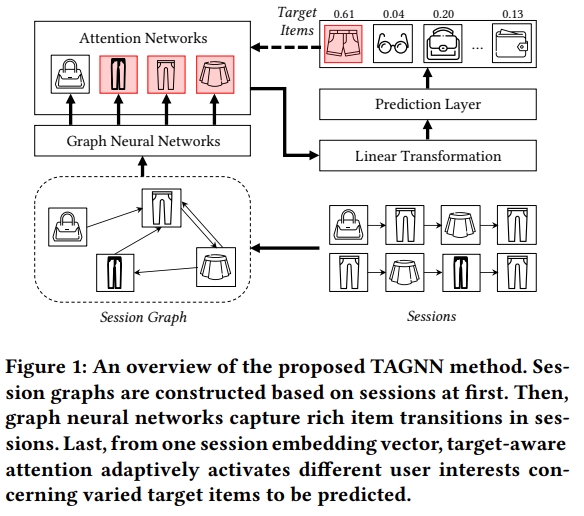

# TAGNN



This is the code for the SIGIR 2020 Paper: [TAGNN: Target Attentive Graph Neural Networks for Session-based Recommendation](https://dl.acm.org/doi/abs/10.1145/3397271.3401319).

## Usage


## Requirements


## Citation

Please cite our paper if you use the code:
```
@inproceedings{yu2020tagnn,
  title={TAGNN: Target attentive graph neural networks for session-based recommendation},
  author={Yu, Feng and Zhu, Yanqiao and Liu, Qiang and Wu, Shu and Wang, Liang and Tan, Tieniu},
  booktitle={Proceedings of the 43rd international ACM SIGIR conference on research and development in information retrieval},
  pages={1921--1924},
  year={2020}
}
```
